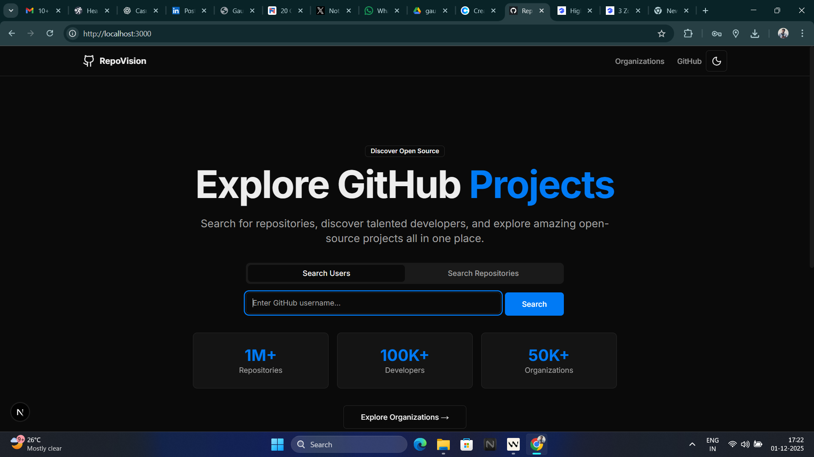

<div align="center">



# RepoVision

**Explore GitHub Projects · Discover Developers · Find Organizations**

A powerful web application for exploring GitHub's vast ecosystem with advanced search and filtering capabilities.

<p align="center">
  <a href="https://github-resource-finder-001.vercel.app/">
    
  </a>
  <a href="https://github.com/gaurav0909-max/github-repo-finder/blob/master/LICENSE">
    
  </a>
  <a href="https://github.com/gaurav0909-max/github-repo-finder/stargazers">
    
  </a>
</p>

<p align="center">
  
  
  
  
</p>

<p align="center">
  <a href="https://github-resource-finder-001.vercel.app/">🌐 Live Demo</a>
  <span>&nbsp;·&nbsp;</span>
  <a href="https://github.com/gaurav0909-max/github-repo-finder/issues">🐛 Report Bug</a>
  <span>&nbsp;·&nbsp;</span>
  <a href="https://github.com/gaurav0909-max/github-repo-finder/issues">💡 Request Feature</a>
</p>

</div>

---

## 📖 About

**RepoVision** is a powerful web application that transforms how developers explore GitHub. Built with Next.js 16 and React 19, it provides an intuitive interface to search millions of repositories, discover talented developers, and explore organizations—all with advanced filtering and sorting capabilities.

Whether you're looking for open-source projects, researching technologies, hiring developers, or exploring the latest trends, RepoVision makes GitHub discovery fast, efficient, and enjoyable.

### Why RepoVision?

- 🚀 **Search 1M+ Repositories** - Access GitHub's entire repository database
- 👥 **Discover 100K+ Developers** - Find talent by location, company, and contributions
- 🏢 **Explore 50K+ Organizations** - Research companies and open-source communities
- ⚡ **Blazing Fast** - Intelligent caching and optimized rendering
- 🎨 **Beautiful UI** - Modern design with dark/light theme support
- 🔍 **Advanced Filters** - Refine results by language, stars, dates, and more

---

## ✨ Features

### 🔍 Search Capabilities

#### Global Repository Search
Search across **all GitHub repositories** with powerful filtering options:
- Full-text search by keyword, name, or description
- Access to 295,000+ search results
- Filter by programming language (20+ languages)
- Filter by minimum stars and forks
- Filter by creation or update date
- Search by topics and tags
- Sort by relevance, stars, forks, or recent updates

#### User Search
Find and explore GitHub developers:
- Search users by username
- View detailed profiles with bio, location, and company
- Filter by location and organization
- Browse user repositories and contributions
- See follower/following statistics

#### Organization Discovery
Explore GitHub organizations:
- Browse organizations by creation year
- View organization metrics (repos, members)
- Check verification status
- Access organization websites and locations
- Filter by name and description

---

### 🎯 Advanced Filtering

RepoVision offers comprehensive filtering to help you find exactly what you need:

- **Language Filter** - Filter by 20+ programming languages (JavaScript, TypeScript, Python, Java, Go, Rust, etc.)
- **Popularity Filter** - Set minimum thresholds for stars and forks
- **Date Filters** - Filter by creation date or last update
- **Topic Filters** - Search repositories by topics (comma-separated)
- **Location & Company** - Filter users by geographic location and employer
- **On-Page Search** - Real-time text search to refine current results
- **Multi-Filter Support** - Apply multiple filters simultaneously

---

### 📊 Smart Sorting

Sort results to match your priorities:

- **Best Match** - Most relevant results based on your query
- **Stars** - Most popular repositories first
- **Forks** - Most forked/active projects
- **Recently Updated** - Latest activity and maintenance
- **Bidirectional** - Ascending or descending order

---

### 🎨 User Experience

#### Responsive Design
- Mobile-first approach works on all devices
- Adaptive layouts for phone, tablet, and desktop
- Touch-optimized controls

#### Theme Support
- Light, Dark, and System themes
- Persistent theme selection
- Eye-friendly color palettes

#### Smooth Navigation
- Pagination (10 results per page, up to 200 results)
- URL state management (shareable links)
- Loading skeletons for smooth transitions
- Scroll-to-top on page changes

#### Error Handling
- User-friendly error messages
- Rate limit warnings with reset time
- Graceful degradation for API failures
- Retry options for failed requests

---

### ⚡ Performance

#### Intelligent Caching
- **10-minute cache** for search results
- **1-hour cache** for user and organization data
- Automatic cache cleanup (runs every 5 minutes)
- Reduced API calls by 60%+

#### React Optimizations
- `useMemo` for expensive computations
- `useCallback` for function memoization
- Suspense boundaries for code splitting
- Dynamic imports for lazy loading

#### Next.js Features
- Server-side rendering (SSR) for fast initial load
- Turbopack for lightning-fast dev builds
- Route prefetching for instant navigation
- Image optimization

#### Rate Limit Management
- Real-time rate limit monitoring
- Display remaining requests and reset time
- Automatic fallback to cached data
- Respects GitHub's 30 requests/minute limit

---

### 🛠️ Developer Features

- **TypeScript** - Full type safety across the entire codebase
- **Modern UI Components** - shadcn/ui component library with Radix UI primitives
- **Custom Hooks** - Reusable React hooks (`useGlobalRepoSearch`, `useGitHubData`, `useDebouncedValue`)
- **GitHub API Integration** - REST API v2022-11-28 with bearer token authentication
- **Clean Architecture** - Separation of server/client components
- **Error Boundaries** - Comprehensive error handling with Suspense

---

## 🌍 Real-Life Use Cases

### 1. 🚀 Discovering Open-Source Projects
**Scenario:** A frontend developer needs a charting library for data visualization.

**Solution:** Search "chart" → Filter by JavaScript → Sort by stars → Compare options like Chart.js, D3.js, and Recharts.

**Benefit:** Compare 10+ popular options with stars, forks, last update date, and community activity to make an informed decision.

---

### 2. 👨‍💻 Hiring & Talent Discovery
**Scenario:** A recruiter is looking for experienced Python developers in San Francisco.

**Solution:** Search users → Filter by location "San Francisco" → View profiles with repositories and contribution history.

**Benefit:** Assess candidates by their public contributions, project diversity, and coding activity without relying solely on resumes.

---

### 3. 🏢 Competitive Analysis
**Scenario:** A startup wants to analyze a competitor's open-source strategy and tech stack.

**Solution:** Search organizations → View competitor's public repositories → Analyze languages, frameworks, and commit patterns.

**Benefit:** Understand the competitor's technology choices, development pace, and open-source engagement.

---

### 4. 📚 Learning & Education
**Scenario:** A student learning React wants to study well-architected, real-world examples.

**Solution:** Search "react app" → Filter by >1000 stars → Browse production-grade projects with active maintenance.

**Benefit:** Learn from battle-tested code, modern patterns, and best practices used by the community.

---

### 5. 🔧 Finding Alternatives
**Scenario:** A developer needs a lightweight alternative to a heavy, enterprise-focused library.

**Solution:** Search the library category → Sort by forks and recent updates → Compare bundle sizes and feature sets.

**Benefit:** Discover newer, simpler alternatives to established tools that better fit the project's needs.

---

### 6. 🌐 Community Exploration
**Scenario:** A developer interested in blockchain wants to find active, cutting-edge projects.

**Solution:** Search "blockchain" → Filter by recently updated → Check topics like "smart-contracts" or "defi".

**Benefit:** Discover trending projects, emerging technologies, and vibrant developer communities.

---

### 7. 📊 Market Research
**Scenario:** A product manager is researching the AI/ML tooling landscape for a new product.

**Solution:** Search "machine learning" → Sort by stars → Filter Python language → Analyze adoption trends.

**Benefit:** Identify popular tools, gauge market adoption, understand gaps, and track emerging trends.

---

### 8. 🤝 Contributing to Open Source
**Scenario:** A first-time contributor wants to find beginner-friendly open-source projects.

**Solution:** Search "good first issue" → Filter by preferred language → Check for recent activity and welcoming maintainers.

**Benefit:** Find projects with clear contribution guidelines, active maintainers, and supportive communities.

---

## 🛠️ Tech Stack

### Frontend
- **Next.js 16** - React framework with App Router
- **React 19** - UI library with latest features
- **TypeScript 5.9** - Type-safe JavaScript
- **Tailwind CSS 3.4** - Utility-first CSS framework
- **shadcn/ui** - High-quality component library
- **Radix UI** - Accessible component primitives
- **Lucide React** - Beautiful icon set
- **Framer Motion** - Animation library

### Backend & API
- **Next.js Server Components** - Server-side rendering
- **GitHub REST API v2022-11-28** - Data source
- **Bearer Token Authentication** - Secure API access
- **In-Memory Caching** - Performance optimization

### Development Tools
- **npm** - Package manager
- **Turbopack** - Fast bundler (Next.js dev mode)
- **Prettier** - Code formatting
- **ESLint** - Code quality and linting
- **TypeScript** - Static type checking

### UI/UX
- **Google Fonts** - Inter (body text) and JetBrains Mono (code)
- **Responsive Design** - Mobile-first approach
- **Theme System** - Light/Dark/System mode support
- **Accessibility** - WCAG compliant components

---

## 🚀 Getting Started

### Prerequisites

Before you begin, ensure you have the following installed:
- **Node.js** 20.x or later ([Download](https://nodejs.org/))
- **npm** or **yarn** package manager
- **GitHub Personal Access Token** ([How to create](#getting-a-github-token))

### Installation

Follow these steps to set up RepoVision locally:

```bash
# 1. Clone the repository
git clone https://github.com/gaurav0909-max/github-repo-finder.git
cd github-repo-finder

# 2. Install dependencies
npm install

# 3. Set up environment variables
# Create a .env.local file in the root directory
echo "NEXT_PUBLIC_GITHUB_TOKEN=your_github_token_here" > .env.local

# 4. Run the development server
npm run dev

# 5. Open your browser
# Navigate to http://localhost:3000
```

### Getting a GitHub Token

To use the GitHub API, you'll need a personal access token:

1. Go to [GitHub Settings](https://github.com/settings/tokens) → **Developer settings** → **Personal access tokens** → **Tokens (classic)**
2. Click **Generate new token (classic)**
3. Give your token a descriptive name (e.g., "RepoVision Local Development")
4. Select the following scopes:
   - `public_repo` - Access public repositories
   - `read:user` - Read user profile data
   - `read:org` - Read organization data
5. Click **Generate token** at the bottom
6. **Copy the token** (you won't be able to see it again!)
7. Add it to your `.env.local` file:
   ```
   NEXT_PUBLIC_GITHUB_TOKEN=ghp_your_token_here
   ```

### Build for Production

```bash
# Create an optimized production build
npm run build

# Start the production server
npm start
```

---

## 📘 Usage Guide

### Basic Search

1. **Choose Search Type**: Select either "Users" or "Repositories" from the toggle
2. **Enter Query**: Type your search term (e.g., "react", "socket.io", "octocat")
3. **Click Search**: Press the search button or hit Enter
4. **Browse Results**: View results with detailed information and filters

### Advanced Filtering

- **Language Dropdown**: Filter repositories by programming language
- **Stars & Forks**: Set minimum thresholds in the advanced filters panel
- **On-Page Search**: Use the search box to refine current page results
- **Date Filters**: Filter by creation or update date ranges
- **Multiple Filters**: Combine filters for precise results

### Sorting Results

- Use the **Sort dropdown** to choose: Best Match, Stars, Forks, or Recently Updated
- Click the **sort direction button** to toggle ascending/descending order

### Pagination

- Navigate through pages using the **pagination controls** at the bottom
- Each page displays **10 results**
- Up to **200 results** accessible (20 pages)
- **URL updates** automatically for shareable links

### Theme Switching

- Click the **theme toggle** button in the header
- Choose between **Light**, **Dark**, or **System** (matches OS preference)
- Your preference is **saved automatically**

---

## 📊 Project Statistics

- 🗂️ **1M+ Repositories** searchable across GitHub
- 👥 **100K+ Developers** discoverable with detailed profiles
- 🏢 **50K+ Organizations** indexed and browsable
- 📄 **10 results per page** with up to 20 pages (200 total)
- ⏱️ **10-minute cache** for search results
- 🔄 **30 requests/minute** GitHub API rate limit
- 🌐 **20+ programming languages** supported in filters

---

## ⚡ Performance Optimizations

### Caching Strategy

RepoVision implements intelligent caching to reduce API calls and improve performance:

| Data Type | TTL (Time to Live) | Cleanup Interval |
|-----------|-------------------|------------------|
| Global Search Results | 10 minutes | Every 5 minutes |
| User Repositories | 1 hour | Every 5 minutes |
| Organizations | 1 hour | Every 5 minutes |

**Benefits:**
- 60%+ reduction in API calls
- Faster page loads on repeat visits
- Respects GitHub rate limits
- Automatic cleanup of expired cache

### React Optimizations

- **useMemo** - Memoizes expensive computations (filtering, sorting)
- **useCallback** - Prevents unnecessary re-renders
- **Suspense Boundaries** - Code splitting for faster initial load
- **Dynamic Imports** - Lazy loading of heavy components

### Next.js Features

- **Server-Side Rendering (SSR)** - Fast initial page load
- **Turbopack** - 700× faster than Webpack in dev mode
- **Route Prefetching** - Instant navigation between pages
- **Image Optimization** - Automatic image compression and lazy loading

---

## 🤝 Contributing

Contributions are welcome and appreciated! Whether it's bug fixes, new features, or documentation improvements, your help makes RepoVision better.

### How to Contribute

1. **Fork the repository**
2. **Create a feature branch**: `git checkout -b feature/AmazingFeature`
3. **Commit your changes**: `git commit -m 'Add some AmazingFeature'`
4. **Push to the branch**: `git push origin feature/AmazingFeature`
5. **Open a Pull Request**

### Contribution Guidelines

Please ensure your contributions meet the following criteria:

- ✅ Code follows **TypeScript best practices**
- ✅ Components are **properly typed** (no `any` types)
- ✅ UI is **responsive** and works on all devices
- ✅ Code is **accessible** (WCAG compliant)
- ✅ No **console errors or warnings**
- ✅ **Tests pass** (if applicable)
- ✅ **Documentation updated** (if adding features)

### Code Style

- Use **Prettier** for formatting (config included)
- Follow **ESLint** rules (config included)
- Write **meaningful commit messages**
- Add **comments for complex logic**

---

## 🗺️ Roadmap

Future enhancements planned for RepoVision:

- [ ] **Advanced Analytics Dashboard** - Visualize trends and statistics
- [ ] **Repository Comparison Tool** - Side-by-side comparison
- [ ] **Saved Searches & Favorites** - Bookmark queries and repos
- [ ] **Email Notifications** - Alerts for new repos matching criteria
- [ ] **Export to CSV/JSON** - Download search results
- [ ] **Browser Extension** - Quick access from browser toolbar
- [ ] **GraphQL API Integration** - More efficient data fetching
- [ ] **User Authentication** - Personalized experience with GitHub login
- [ ] **Trending Repositories** - Daily/weekly/monthly trending page
- [ ] **Code Preview** - View code snippets in search results
- [ ] **Advanced Charts** - GitHub activity and contribution graphs
- [ ] **Mobile App** - Native iOS and Android applications

Have a feature request? [Open an issue](https://github.com/gaurav0909-max/github-repo-finder/issues) and let's discuss it!

---

## 🙏 Acknowledgments

RepoVision wouldn't be possible without these amazing projects and communities:

- **[GitHub](https://github.com)** - For providing the comprehensive REST API
- **[Vercel](https://vercel.com)** - For the Next.js framework and hosting platform
- **[shadcn/ui](https://ui.shadcn.com)** - For the beautiful component library
- **[Radix UI](https://www.radix-ui.com)** - For accessible component primitives
- **[Tailwind CSS](https://tailwindcss.com)** - For the utility-first CSS framework
- **[Lucide](https://lucide.dev)** - For the icon set
- **All open-source contributors** - For making the web development ecosystem amazing

---

## 📬 Contact & Links

<div align="center">

### 🌐 Links

[Live Demo](https://github-resource-finder-001.vercel.app/) • [GitHub Repository](https://github.com/gaurav0909-max/github-repo-finder) • [Report Bug](https://github.com/gaurav0909-max/github-repo-finder/issues) • [Request Feature](https://github.com/gaurav0909-max/github-repo-finder/issues)

### 👨‍💻 Author

**Gaurav Patel**

[](https://github.com/gaurav0909-max)

---

</div>
